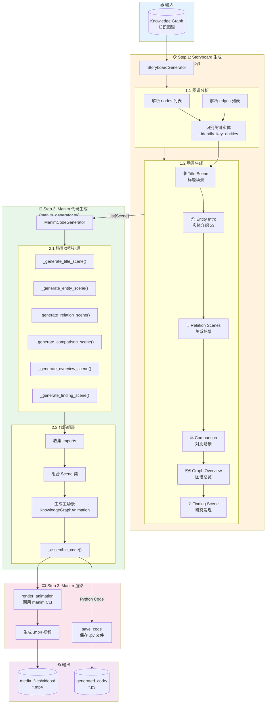

# 动画生成模块内部流程

## 📊 整体流程图



---

## 🔄 详细步骤说明

### Step 1: Storyboard 生成 (`storyboard.py`)

```
┌─────────────────────────────────────────────────────────────────┐
│                    StoryboardGenerator                          │
├─────────────────────────────────────────────────────────────────┤
│  输入: kg_dict = {"nodes": [...], "edges": [...]}              │
├─────────────────────────────────────────────────────────────────┤
│                                                                 │
│  1. __init__(): 初始化                                          │
│     ├── self.nodes = {node_id: node_dict}  # 节点索引          │
│     └── self.edges = [edge_dict, ...]      # 边列表            │
│                                                                 │
│  2. generate(): 生成场景序列                                    │
│     │                                                           │
│     ├── _add_title_scene()          → SceneType.TITLE          │
│     │   └── 从 Paper 类型节点提取标题                           │
│     │                                                           │
│     ├── _identify_key_entities()    → 识别关键实体              │
│     │   └── 按连接数排序，选 Top 3                              │
│     │                                                           │
│     ├── _add_entity_scene() × 3     → SceneType.ENTITY_INTRO   │
│     │   └── 应用 ENTITY_STYLES 样式                             │
│     │                                                           │
│     ├── _add_grouped_relation_scenes()                          │
│     │   ├── 按关系类型分组                                      │
│     │   ├── 单关系 → _add_relation_scene() → SceneType.RELATION│
│     │   └── 多关系 → _add_comparison_scene() → SceneType.COMPARISON│
│     │                                                           │
│     ├── _add_overview_scene()       → SceneType.GRAPH_OVERVIEW │
│     │   └── 显示所有节点和边的总览                              │
│     │                                                           │
│     └── _add_finding_scene()        → SceneType.FINDING        │
│         └── 展示 Finding 类型节点                               │
│                                                                 │
│  输出: List[Scene] → 转换为 List[Dict] 返回                     │
└─────────────────────────────────────────────────────────────────┘
```

#### 场景类型 (SceneType)

| 类型 | 枚举值 | 说明 | 动画效果 |
|------|--------|------|----------|
| `TITLE` | title | 标题场景 | 文字淡入，居中显示 |
| `ENTITY_INTRO` | entity_intro | 实体介绍 | 圆角矩形框 + 类型标签 |
| `RELATION` | relation | 关系展示 | 两实体 + 箭头连接 |
| `COMPARISON` | comparison | 对比场景 | 多实体网格对比 |
| `GRAPH_OVERVIEW` | graph_overview | 图谱总览 | NetworkX 布局 + 全局展示 |
| `FINDING` | finding | 研究发现 | 高亮星形标记 |
| `TIMELINE` | timeline | 时间线 | (预留) |

---

### Step 2: Manim 代码生成 (`manim_generator.py`)

```
┌─────────────────────────────────────────────────────────────────┐
│                    ManimCodeGenerator                           │
├─────────────────────────────────────────────────────────────────┤
│  输入: scenes = [scene_dict, ...]                               │
├─────────────────────────────────────────────────────────────────┤
│                                                                 │
│  1. generate(): 主生成流程                                       │
│     │                                                           │
│     ├── 遍历每个 scene:                                         │
│     │   │                                                       │
│     │   ├── scene_type == "title"                               │
│     │   │   └── _generate_title_scene(idx, scene)              │
│     │   │       ├── Text() 标题文字                             │
│     │   │       └── Write() + FadeOut() 动画                    │
│     │   │                                                       │
│     │   ├── scene_type == "entity_intro"                        │
│     │   │   └── _generate_entity_scene(idx, scene)             │
│     │   │       ├── RoundedRectangle() 实体框                   │
│     │   │       ├── Text() 实体名称                             │
│     │   │       └── Create() + Write() 动画                     │
│     │   │                                                       │
│     │   ├── scene_type == "relation"                            │
│     │   │   └── _generate_relation_scene(idx, scene)           │
│     │   │       ├── 两个 RoundedRectangle                       │
│     │   │       ├── Arrow() 连接箭头                            │
│     │   │       ├── Text() 关系标签                             │
│     │   │       └── 依次出现动画                                │
│     │   │                                                       │
│     │   ├── scene_type == "comparison"                          │
│     │   │   └── _generate_comparison_scene(idx, scene)         │
│     │   │       ├── 网格布局多个实体                            │
│     │   │       ├── 多条 Arrow/Line                             │
│     │   │       └── 分组动画                                    │
│     │   │                                                       │
│     │   ├── scene_type == "graph_overview"                      │
│     │   │   └── _generate_overview_scene(idx, scene)           │
│     │   │       ├── Graph() Manim 图对象                        │
│     │   │       ├── spring_layout 布局                          │
│     │   │       └── Create() 整体展示                           │
│     │   │                                                       │
│     │   └── scene_type == "finding"                             │
│     │       └── _generate_finding_scene(idx, scene)            │
│     │           ├── Star() 星形标记                             │
│     │           ├── Text() 发现内容                             │
│     │           └── GrowFromCenter() 动画                       │
│     │                                                           │
│     ├── _generate_main_scene()                                  │
│     │   └── 生成 KnowledgeGraphAnimation 主类                   │
│     │       └── 顺序调用所有子场景                              │
│     │                                                           │
│     └── _assemble_code()                                        │
│         ├── 生成 imports 语句                                   │
│         ├── 添加颜色常量 (BLUE, GREEN, etc.)                    │
│         ├── 拼接所有 Scene 类代码                               │
│         └── 返回完整 Python 代码                                │
│                                                                 │
│  输出: str (完整的 .py 文件内容)                                │
└─────────────────────────────────────────────────────────────────┘
```

#### 生成的代码结构

```python
# Auto-generated Manim animation code
from manim import Scene, Text, Write, Create, ...
import numpy as np

# 颜色常量
BLUE = "#3498db"
GREEN = "#2ecc71"
...

class TitleScene0(Scene):
    def construct(self):
        title = Text("...", font_size=48)
        self.play(Write(title))
        ...

class EntityScene1(Scene):
    def construct(self):
        box = RoundedRectangle(...)
        ...

class RelationScene2(Scene):
    ...

# 主场景 - 组合所有子场景
class KnowledgeGraphAnimation(Scene):
    def construct(self):
        TitleScene0.construct(self)
        self.clear()
        EntityScene1.construct(self)
        self.clear()
        ...
```

---

### Step 3: Manim 渲染

```
┌─────────────────────────────────────────────────────────────────┐
│                      渲染流程                                    │
├─────────────────────────────────────────────────────────────────┤
│                                                                 │
│  方式 A: save_code() + 手动渲染                                  │
│  ──────────────────────────────────────────                     │
│                                                                 │
│  save_code(scenes, "output/generated_code/demo.py")            │
│       │                                                         │
│       └── 保存 .py 文件                                         │
│                                                                 │
│  $ manim -ql --media_dir output/media_files demo.py \          │
│          KnowledgeGraphAnimation                                │
│       │                                                         │
│       ├── -ql: 低质量 (480p15)                                  │
│       ├── -qm: 中质量 (720p30)                                  │
│       ├── -qh: 高质量 (1080p60)                                 │
│       └── -qk: 4K (2160p60)                                     │
│                                                                 │
│  方式 B: render_animation() 自动渲染                             │
│  ──────────────────────────────────────────                     │
│                                                                 │
│  render_animation(scenes, "output.mp4", quality="low_quality") │
│       │                                                         │
│       ├── 1. 生成代码到临时文件                                 │
│       ├── 2. 计算 media_dir (output/media_files)               │
│       ├── 3. 调用 subprocess: manim -ql temp.py ...            │
│       ├── 4. 等待渲染完成                                       │
│       └── 5. 清理临时文件                                       │
│                                                                 │
│  输出文件:                                                       │
│  ──────────────────────────────────────────                     │
│  output/                                                        │
│  ├── generated_code/                                            │
│  │   └── demo_animation.py     # 生成的 Manim 代码              │
│  └── media_files/                                               │
│      └── videos/                                                │
│          └── demo_animation/                                    │
│              └── 480p15/                                        │
│                  ├── KnowledgeGraphAnimation.mp4  # 最终视频    │
│                  └── partial_movie_files/         # 片段缓存    │
│                                                                 │
└─────────────────────────────────────────────────────────────────┘
```

---

## 🎯 API 调用示例

```python
from animation import storyboard_from_kg, generate_code, save_code, render_animation

# 1. 准备知识图谱
kg = {
    "nodes": [
        {"id": "gpt4", "type": "Method", "name": "GPT-4"},
        {"id": "mmlu", "type": "Dataset", "name": "MMLU"},
        {"id": "acc",  "type": "Metric",  "name": "Accuracy 86.4%"},
    ],
    "edges": [
        {"source": "gpt4", "target": "mmlu", "type": "evaluated_on"},
        {"source": "gpt4", "target": "acc",  "type": "achieves"},
    ]
}

# 2. 生成故事板
scenes = storyboard_from_kg(kg, max_scenes=8)
# → [{"scene_type": "title", ...}, {"scene_type": "entity_intro", ...}, ...]

# 3. 生成 Manim 代码
code = generate_code(scenes)
# → "from manim import ...\n\nclass TitleScene0(Scene):..."

# 4a. 保存代码（手动渲染）
save_code(scenes, "output/generated_code/demo.py")

# 4b. 或直接渲染
render_animation(scenes, "output/demo.mp4", quality="low_quality")
```

---

## 📁 文件结构

```
animation/
├── __init__.py           # 模块导出
├── storyboard.py         # 故事板生成 (规则驱动)
│   ├── SceneType         # 场景类型枚举
│   ├── Scene             # 场景数据类
│   ├── StoryboardGenerator  # 主生成器
│   ├── RELATION_STYLES   # 关系样式配置
│   ├── ENTITY_STYLES     # 实体样式配置
│   ├── storyboard_from_kg()  # 主入口函数
│   └── quick_storyboard()    # 快速生成
├── manim_generator.py    # Manim 代码生成 (模板驱动)
│   ├── ManimCodeGenerator    # 代码生成器类
│   ├── generate_code()       # 生成代码
│   ├── render_animation()    # 渲染动画
│   └── save_code()           # 保存代码
└── llm_enhanced.py       # 🆕 LLM 增强动画生成
    ├── LLMStoryboardGenerator   # LLM 故事板生成器
    ├── LLMManimGenerator        # 混合代码生成器
    ├── llm_storyboard_from_kg() # LLM 故事板入口
    ├── llm_generate_code()      # 混合代码生成
    └── llm_animation_pipeline() # 完整流程
```

---

## 🤖 LLM 增强模式 (方案 C)

### 流程对比

```
规则驱动 (快速、稳定):
KG ──[规则]──> Storyboard ──[模板]──> Manim Code ──> 视频

LLM 增强 (灵活、有创意):
KG ──[LLM]──> 智能 Storyboard ──[混合]──> Manim Code ──> 视频
                    │                    │
                    │                    ├── 简单场景: 模板生成 (稳定)
                    │                    └── 复杂场景: LLM 生成 (灵活)
                    │
                    └── 智能解说词、场景规划、动画建议
```

### LLM 增强 API 示例

```python
from animation import llm_animation_pipeline, llm_storyboard_from_kg, llm_generate_code

# 方式 1: 完整流程
llm_animation_pipeline(kg_dict, "output.py", max_scenes=6)

# 方式 2: 分步调用
storyboard = llm_storyboard_from_kg(kg_dict, max_scenes=6)  # LLM 生成故事板
code = llm_generate_code(storyboard)                        # 混合生成代码
```

### 生成的故事板示例

```json
{
  "title": "大语言模型性能对比之旅",
  "summary": "GPT-4在MMLU基准测试上优于Llama-3的表现",
  "scenes": [
    {
      "scene_type": "title",
      "title": "探索AI模型的竞技场",
      "narration": "欢迎来到大语言模型的能力评测世界...",
      "animation_hints": "三个元素从屏幕三个方向飞入"
    },
    {
      "scene_type": "comparison",
      "title": "双雄对决",
      "narration": "当GPT-4和Llama-3同时参加MMLU考试...",
      "animation_hints": "两个模型下方出现动态进度条对比"
    }
  ]
}
```

---

## 🔧 样式配置

### ENTITY_STYLES (实体样式)

| 实体类型 | 颜色 | 形状 | 图标 |
|----------|------|------|------|
| Method | #3498db (蓝) | rectangle | ⚙️ |
| Dataset | #2ecc71 (绿) | cylinder | 📊 |
| Metric | #f1c40f (黄) | diamond | 📏 |
| Task | #9b59b6 (紫) | hexagon | 🎯 |
| Finding | #e74c3c (红) | star | 💡 |
| Paper | #34495e (灰) | document | 📄 |
| Hypothesis | #1abc9c (青) | cloud | 🔮 |

### RELATION_STYLES (关系样式)

| 关系类型 | 颜色 | 箭头 | 中文标签 |
|----------|------|------|----------|
| uses | #3498db | -> | 使用 |
| evaluated_on | #2ecc71 | -> | 评估于 |
| achieves | #f1c40f | -> | 达成 |
| supports | #9b59b6 | -> | 支持 |
| contradicts | #e74c3c | <-> | 矛盾 |
| outperform | #e67e22 | >> | 优于 |
