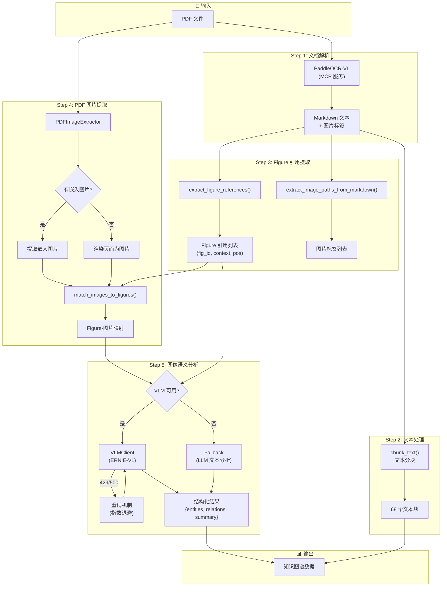
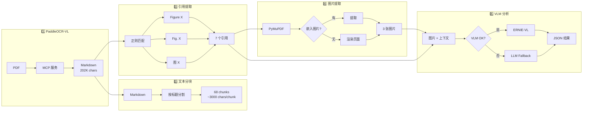
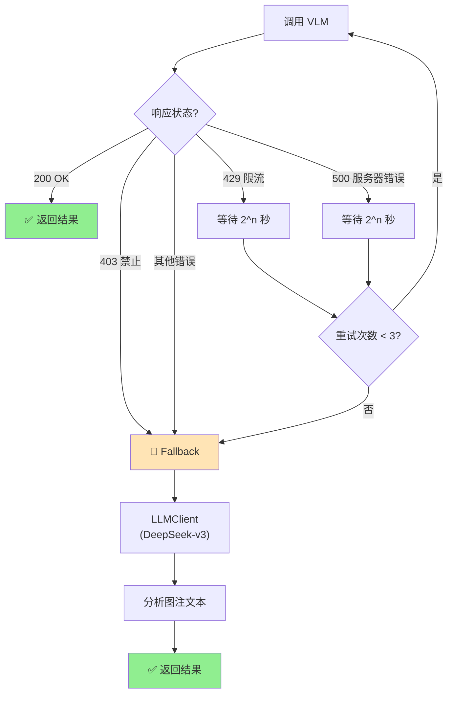
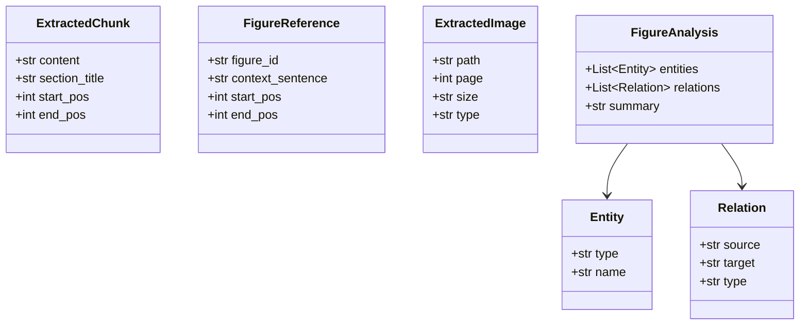

# 提取模块工作流程图

## 整体架构



## 详细模块说明

### 📁 文件结构

```
extraction/
├── __init__.py              # 模块导出
├── paddleocr_vl.py          # PaddleOCR-VL MCP 客户端
├── text_extractor.py        # chunk_text() 文本分块
├── vision_extractor.py      # Figure 引用 + VLM 分析
└── image_extractor.py       # PDF 图片提取

utils/
└── vllm_client.py           # VLM 客户端 (重试 + Fallback)
```

### 🔄 数据流详解



### ⚡ 错误处理与重试机制



### 📊 输出数据结构



## 🎯 关键函数调用链

```
main.py
│
├── PaddleOCRVLClient.parse_pdf(pdf_path)
│   └── → markdown: str
│
├── chunk_text(markdown)
│   └── → chunks: List[str]
│
├── extract_figure_references(markdown)
│   └── → refs: List[(fig_id, context, start, end)]
│
├── PDFImageExtractor.extract_images(pdf_path)
│   ├── extract_embedded_images()
│   └── extract_page_as_image() [fallback]
│       └── → images: List[Dict]
│
├── match_images_to_figures(images, refs, markdown)
│   └── → matches: Dict[fig_id → image_info]
│
└── VLMClient.analyze_figure(image_path, caption, context)
    ├── _call_with_retry()
    │   └── → VLM response
    └── _fallback_text_analysis() [if VLM unavailable]
        └── → {entities, relations, summary}
```

## 📈 性能指标 (测试文件)

| 步骤 | 耗时 | 输出 |
|------|------|------|
| PaddleOCR-VL | ~10s | 202,731 chars |
| 文本分块 | <1s | 68 chunks |
| 引用提取 | <1s | 7 refs |
| 图片提取 | ~2s | 3 images |
| VLM/Fallback | ~3s | 9 entities, 6 relations |

---

*Generated for AI科研辅助智能体 Demo*
